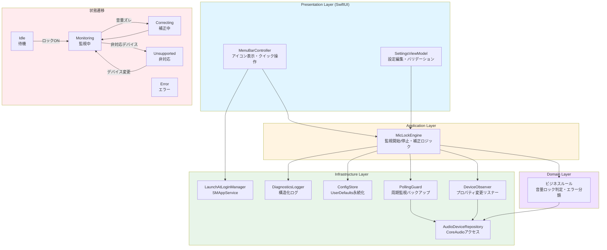
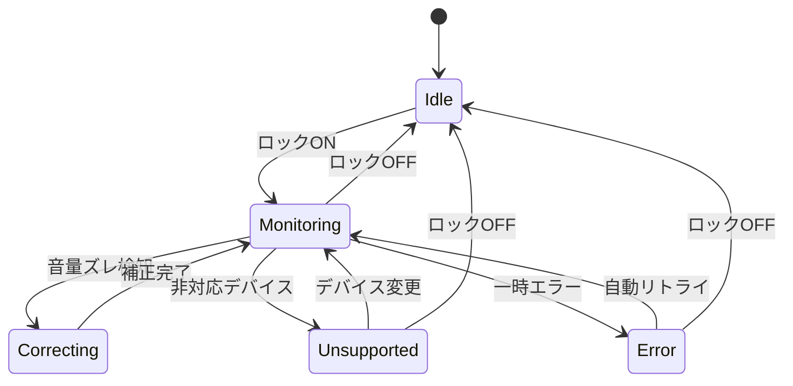
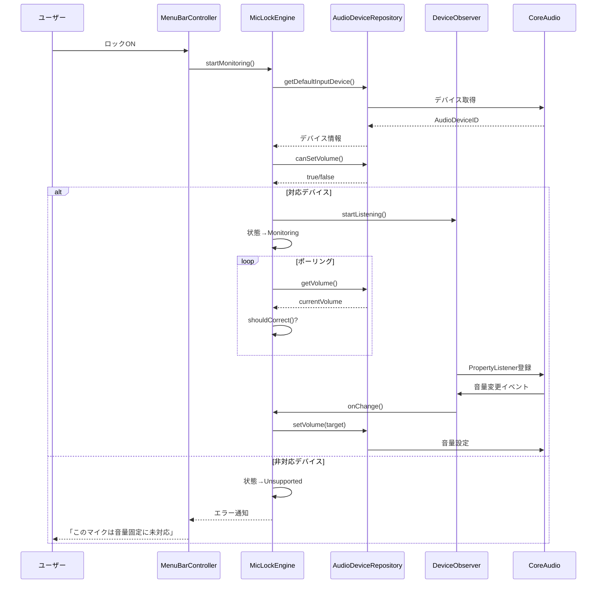
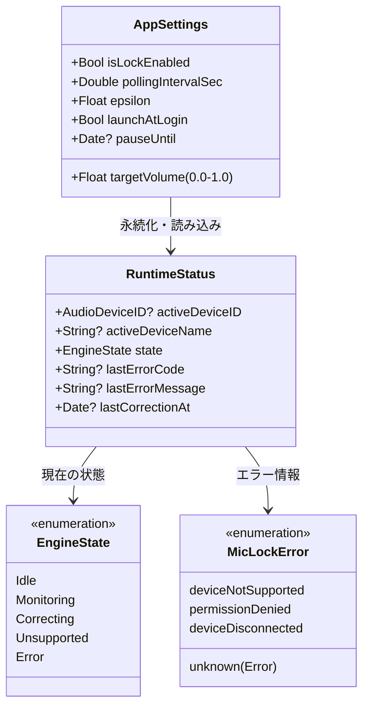

# MicLock アーキテクチャ

## 全体構成図

## 状態遷移詳細図

## コンポーネント構成

### Presentation Layer (SwiftUI)
| コンポーネント | 責務 |
|--------------|------|
| MenuBarController | メニューバーアイコン表示、クイックトグル、設定表示 |
| SettingsViewModel | 目標音量スライダー、監視間隔、epsilon、自動起動トグル |

### Application Layer
| コンポーネント | 責務 |
|--------------|------|
| MicLockEngine | 監視ライフサイクル、ドリフト検知、補正実行 |

### Domain Layer
| コンポーネント | 責務 |
|--------------|------|
| EngineState | 状態管理（Idle/Monitoring/Correcting/Unsupported/Error） |
| RuntimeStatus | 実行時ステータス（デバイス情報、エラー情報など） |
| VolumeDriftDetector | 音量ドリフト判定ロジック |
| MicLockError | エラー分類と回復可能判定 |

### Infrastructure Layer
| コンポーネント | 責務 |
|--------------|------|
| AudioDeviceRepository | デフォルト入力デバイス取得、音量読み書き、対応可否チェック |
| DeviceObserver | CoreAudio プロパティ変更のリスニング |
| PollingGuard | バックアップ用の定期ボリュームチェック |
| ConfigStore | UserDefaults 経由の設定保存/読み込み |
| DiagnosticsLogger | トラブルシューティング用構造化ログ |
| LaunchAtLoginManager | SMAppService 経由のログイン項目有効/無効 |

## データフロー

## 設定データモデル

